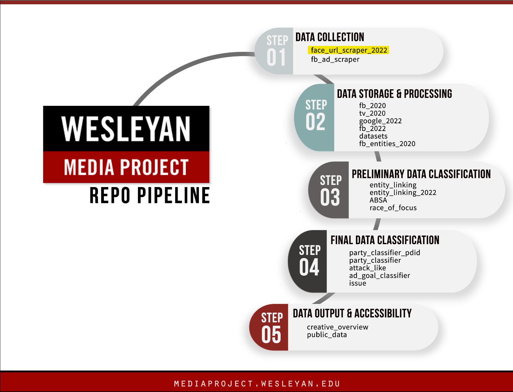

# Wesleyan Media Project - Face_Url_Scraper_2022

Welcome! This repo is part of the Cross-platform Election Advertising Transparency initiatIVE ([CREATIVE](https://www.creativewmp.com/)) project. CREATIVE is a joint infrastructure project of WMP and privacy-tech-lab at Wesleyan University. CREATIVE provides cross-platform integration and standardization of political ads collected from Google and Facebook.

This repo is a part of Data Collection step. You will also need the repo [Datasets](https://github.com/Wesleyan-Media-Project/datasets) to run the codes.

## Table of Contents

- [Introduction](#introduction)
    - [Objective](#objective) 
        

- [Data](#data)
    - [Results](#results)
    - [Face categories](#face-categories)
        - [Legislative](#legislative)
        - [Executive](#executive)
        - [Judicial](#judicial)
        - [Other prominent persons](#other-prominent-persons)

    - [What can you do with this data?](#what-can-you-do-with-this-data)
    - [Copyrights of face images](#copyrights-of-face-images)

- [Setup](#setup)
## Introduction
This repo contains the codes that clean-up and scrape political figures' URLs for the 2022 election cycle. The online venues where we search for face images include:

    - Ballotpedia 
    - Wikipedia
    - Persons' facebook pages
    - Candidate campaign websites
    - Votesmart

We only use a scraped face from Votesmart (size-wise not ideal for face recognition)when we could not find face images in any of the other listed venues. And at the final face quality control stage, we also use a few face images from other websites. The data produced by each script is stored in the `data` folder. In the end, they would be combined and organize into a single csv file: `result_face_url_2022.csv` through code `08_face_url_final_selection.ipynb`.

## Objective

Each of our repos belongs to one or more of the the following categories:
- Data Collection
- Data Storage & Processing
- Preliminary Data Classification
- Final Data Classification

This repo is part of the Data Collection section.

## Data

The data created by the scripts in this repo is in csv format. 

### Results
- Include 1650 unique wmpids (faces) for the 2022 face collection
- Among them, 94 wmpids do not have face images
- The face_collection_2022 folder thus includes 1556 face image files
- The face_collection_2022 folder can be found at: DeltaLab>github>face_url_scraper_2022

The final output contains the following fields:

 - **wmpid**: unique id for each political figure
 - **Full_name**: full name of the political figure
 - **Face_url_2022**: the url of the face image
 - **Face_category_2022**: the category of the political figure 
### Face categories

#### Legislative
- Candidate source: wmpcand_012523_wmpid.csv
- Face url source: ballotpedia / wikipedia

1. House canddiate (1193)
2. Senate candidate (173) 
3. Sitting US senators -117th (100)

#### Executive
1. Current president (1)

2. All former presidents (44)
    - face url source: https://www.whitehouse.gov/about-the-white-house/presidents/
    
3. Cabinet (25) 
    - Face url source: https://www.whitehouse.gov/administration/cabinet/
    
4. Gubernatorial candidates (82)
    - Candidate source: Priors 2022.xlsx provided by ABC News

5. Sitting governor (14)
    - face url source: https://www.nga.org/governors/
    
6. Public health related leaders (6)
    - The Secretary of the Department of Health and Human Services
    - The Surgeon General
    - Director of the National Institute of Allergy and Infectious Diseases
    - Directors of CDC, FDA, NIH

#### Judicial
Judicial (16)
1. Supreme Court Justice (current)
2. Supreme Court Justice (former) - all who took judicial oath after 1980
    - face url source: https://www.supremecourt.gov/about/biographies.aspx

#### Other prominent persons
1. Other prominent politicians(3): Mike Pence, Hilary Clinton, Robert Mueller
2. International political leaders (23)
    - G20: https://en.wikipedia.org/wiki/G20
    - The secretary general of UN
    - Director of WHO - Tedros Adhanom
3. Political historical figures (1)
    - MLK

### What can you do with this data?
This repo produced a cleaned version of political figures' face image urls in cvs format. We believe there are various ways you can use it for political ads analyses: You may use it as face recognition to recognize which political figure is present ads.
You may also you it for sentiment analysis to see if the ads are supporting or attacking the political figure.

### Copyrights of face images
- Ballotpedia: https://ballotpedia.org/Ballotpedia:Image_use_policy
    - GFDL licenses
    - "These images are available for reuse in non-commercial settings with attribution. Please use the following language when using any images that belong to Ballotpedia:This image comes from the website Ballotpedia.org. It is suitable for reuse under GFDL licensing."
    
- Wikipedia: https://en.wikipedia.org/wiki/Wikipedia:Image_use_policy
    - GFDL licenses
- Whitehouse: https://www.whitehouse.gov/copyright/
    - Creative Commons Attribution 3.0 License: https://creativecommons.org/licenses/by/3.0/us/
    - "Share — copy and redistribute the material in any medium or format"
- National Governors Association: N.A.
- Supreme Court: N.A.

## Setup

 First, make sure you have the [datasets](https://github.com/Wesleyan-Media-Project/datasets) repo cloned. 

 Then, you need to install the following libraries in R:

    - tidyverse
    - rvest
    - httr
    - xml2
 Next, install the following packages for Python:

    - pandas
    - numpy
    - bs4
    - urllib
    - re
    - fuzzywuzzy
After you have installed the required libraries, you can now run the code follow the order of the numbers in the file names (e.g. you can start with: 01_ballotpedia_scaper_senate_cleanup.ipynb, then 01_ballotpedia_scaper_senate.ipynb, then 02_ballotpedia_scaper_house_cleanup.ipynb ...
  08_face_url_final_selection.ipynb)

Please be careful when re-runing this script as many face images are replaced with current office holder on relevant official websites.
